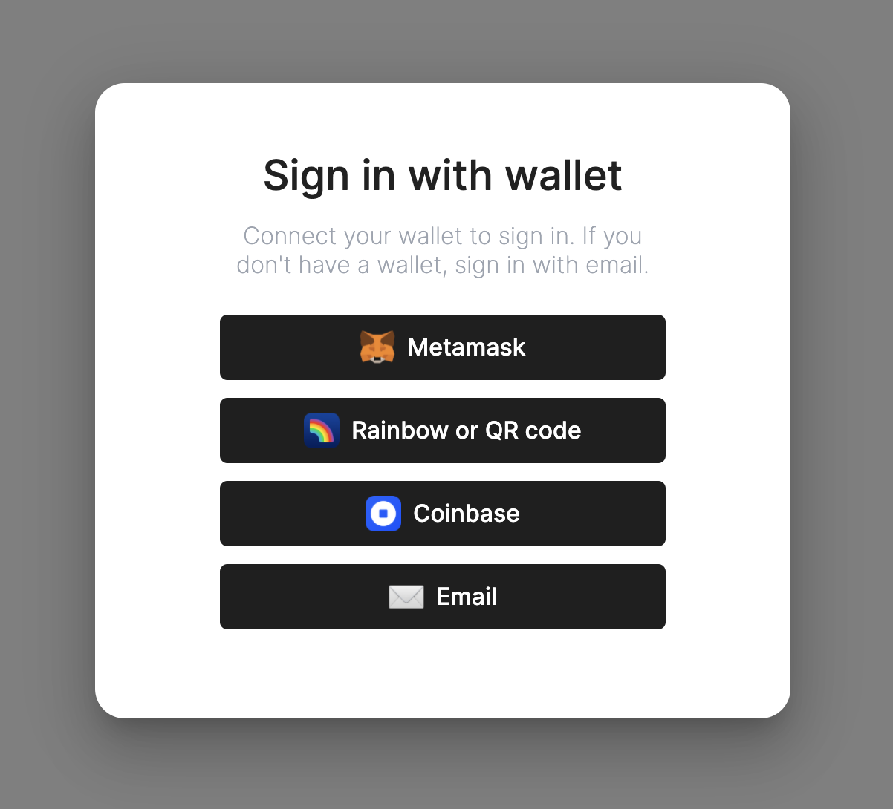

# @buildship/web3-login (beta)



This is a design-focused web3 wallet connecting modal for React based on [Material UI](https://github.com/mui/material-ui). 

It supports [Metamask](https://metamask.io/), [WalletConnect](https://walletconnect.com/), [Coinbase Wallet](https://walletlink.org/) and wallet-less email auth via [Magic](https://magic.link).

## Getting started

Install with yarn:

```bash
yarn add @buildship/web3-login
```
Install with npm:

```bash
npm i @buildship/web3-login
```

Use it in your code:

```javascript
import { Web3Provider, ConnectWallet, AddressView } from "@buildship/web3-login";

// Wallets that you want to support
const connectors = {
    // Metamask
    injected: {},
    magic: {
        apiKey: "pk_...", // Your Magic api key
        chainId: 1, // The chain ID you want to allow on Magic
    },
    walletconnect: {},
    // Coinbase
    walletlink: {
        appName: "Buildship Example",
        url: "https://buildship.dev", 
        darkMode: false,
    }
}

const App = () => {
    const { address } = useWeb3()

    return <Web3Provider
        supportedChainIds={[1, 4]}
        connectors={connectors}>

        {/* autoOpen will pop the modal on page load */}
        <ProfileView autoOpen={false}
            renderButton={({ children, onClick }) => (
            <button className="my-button-class" onClick={onClick}>
                {children}
            </button>
            )}
        />

    </Web3Provider>
}

```

## Theming
Follow Material UI [guide on theming](https://mui.com/customization/theming/), then pass your `theme` object like this:

```javascript
<Web3Provider
    theme={theme}
    connectors={connectors}> 
    // ...
</Web3Provider>
```

[Default theme example](https://github.com/buildship-dev/web3-login/blob/main/src/styles/theme.tsx)

## Plans
- [ ] Support hooks for backend auth
- [ ] Improve experience for Metamask users on mobile
- [ ] Fix WalletConnect mobile deeplink issues
- [ ] Vanilla JS (pure JS) support for in-browser games, etc.
- [ ] Native support for Ledger
- [ ] Support hooks for ENS

## Contributing & issues
Feel free to open a PR or an issue! Contact us at https://buildship.dev/ if you have additional questions

## Thanks
Huge thanks to [context.app](https://context.app) & [web3Modal](https://github.com/Web3Modal/web3modal) for inspiration, and to [web3-react](https://github.com/NoahZinsmeister/web3-react) and [Thirdweb](https://github.com/thirdweb-dev/ui) for making this easy.
